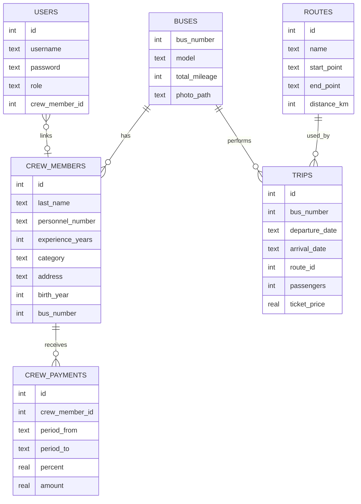

# Схема базы данных

SQL-скрипт расположен в файле [data/schema.sql](../../data/schema.sql).

```mermaid
erDiagram
  USERS }o--o| CREW_MEMBERS : links
  BUSES ||--o{ CREW_MEMBERS : has
  BUSES ||--o{ TRIPS : performs
  ROUTES ||--o{ TRIPS : used_by
  CREW_MEMBERS ||--o{ CREW_PAYMENTS : receives

  USERS {
    int id
    text username
    text password
    text role
    int crew_member_id
  }
  BUSES {
    int bus_number
    text model
    int total_mileage
    text photo_path
  }
  ROUTES {
    int id
    text name
    text start_point
    text end_point
    int distance_km
  }
  CREW_MEMBERS {
    int id
    text last_name
    text personnel_number
    int experience_years
    text category
    text address
    int birth_year
    int bus_number
  }
  TRIPS {
    int id
    int bus_number
    text departure_date
    text arrival_date
    int route_id
    int passengers
    real ticket_price
  }
  CREW_PAYMENTS {
    int id
    int crew_member_id
    text period_from
    text period_to
    real percent
    real amount
  }
```
