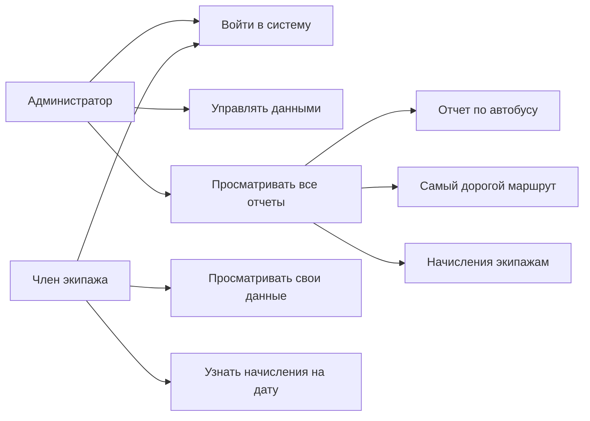

# Функциональные требования

## Акторы

- Администратор управляет справочниками, добавляет рейсы и просматривает все отчеты.
- Член экипажа просматривает только собственные данные и начисления.

## Требования

1. Система выполняет аутентификацию и авторизацию пользователей.
2. Система хранит маршруты, автобусы, членов экипажа и выполненные рейсы.
3. Администратор может добавлять рейсы, изменять количество пассажиров и удалять рейсы средствами приложения.
4. Система выводит перечень рейсов указанного автобуса за период.
5. Система выводит количество поездок, пассажиров и сумму денег по указанному автобусу.
6. Система рассчитывает начисления каждому экипажу за период.
7. Система выводит сведения по наиболее дорогому маршруту.
8. Система выводит автобус с наибольшим суммарным пробегом.
9. Система выводит начисления указанному члену экипажа на указанную дату.
10. Система проверяет существование автобуса и маршрута при добавлении рейса.

## Use Case

## Текстовый сценарий: начисления указанному экипажу

1. Пользователь входит в систему.
2. Система проверяет роль пользователя.
3. Администратор вводит ID члена экипажа, дату и процент начисления.
4. Член экипажа вводит только дату и процент, ID берется из профиля.
5. Система находит рейсы автобуса экипажа на указанную дату.
6. Система выводит сумму начисления.
