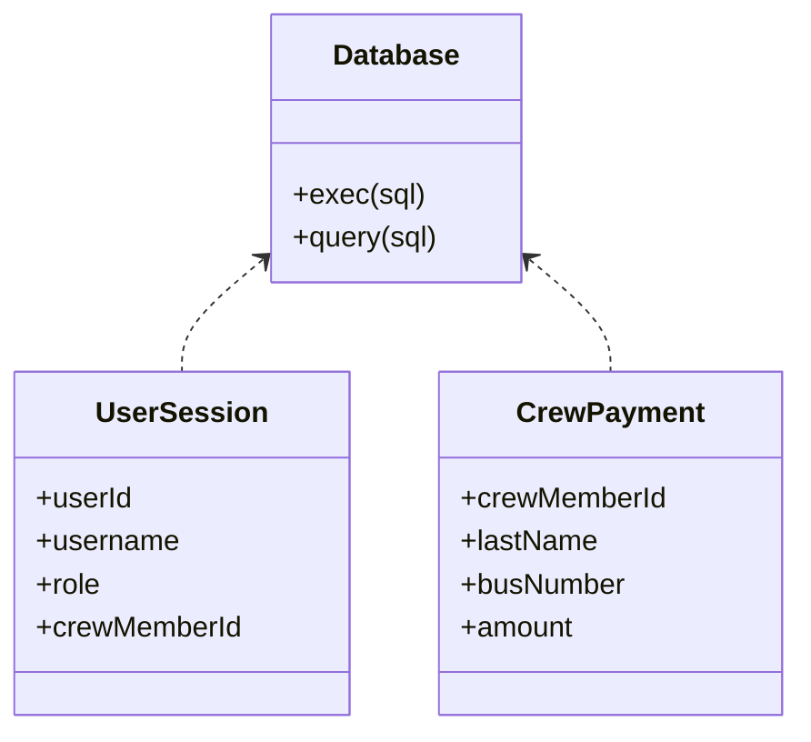
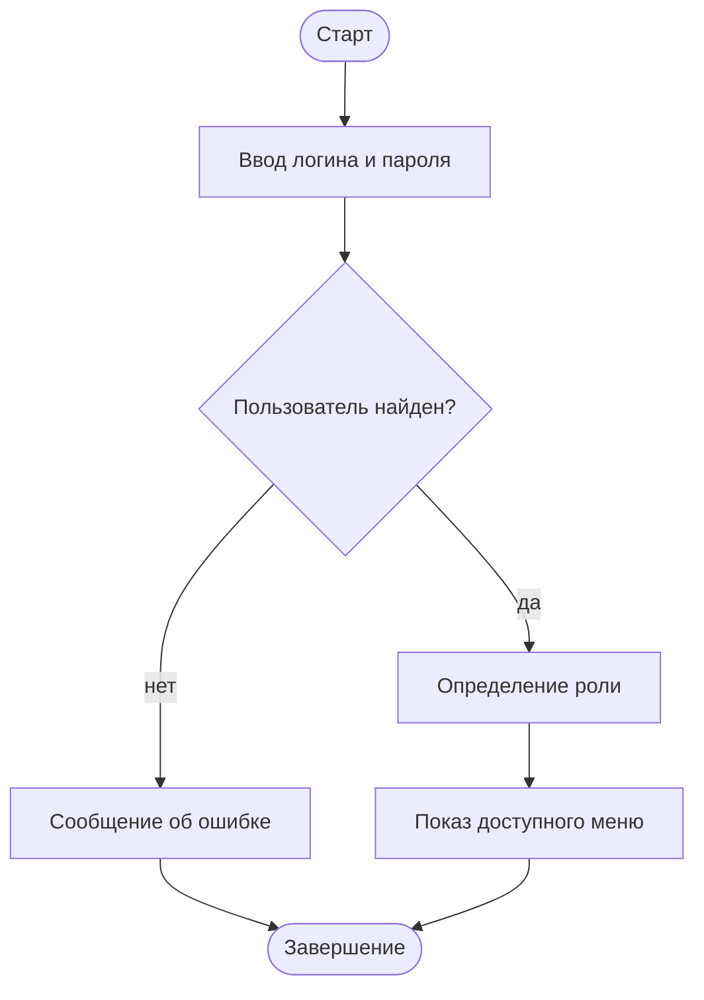
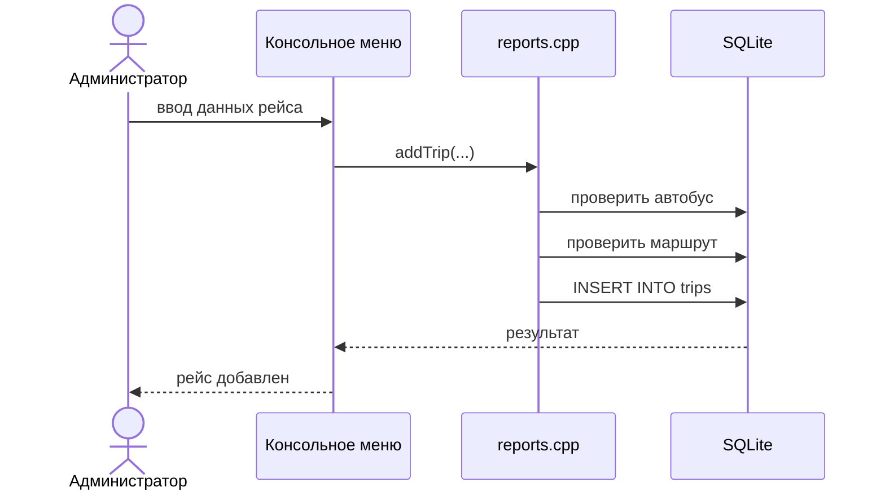
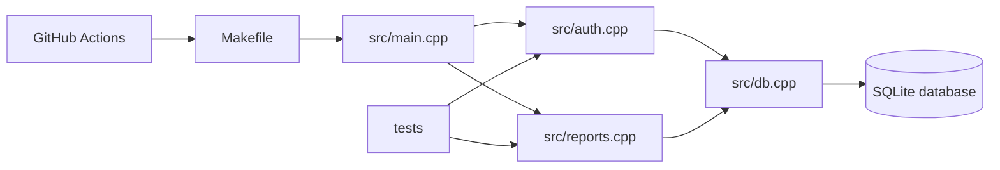
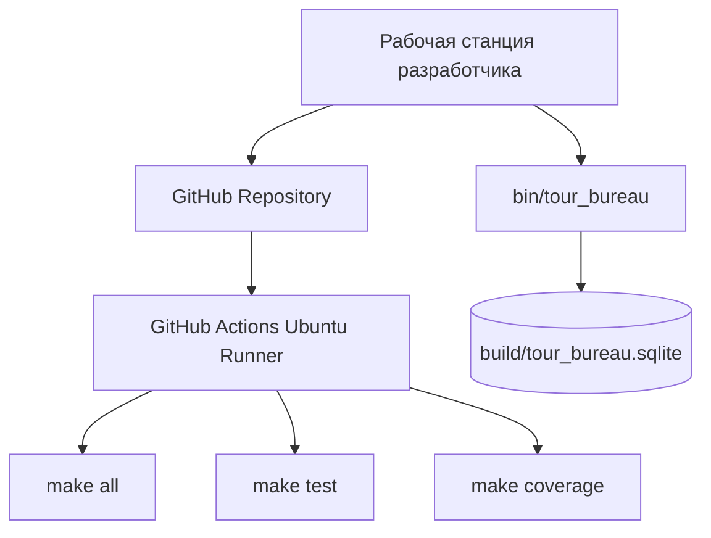

# Спецификация проекта

## Диаграмма классов

## Диаграмма деятельности: вход в систему

## Диаграмма последовательности: добавление рейса

## Диаграмма компонентов

## Диаграмма развертывания

